<p align="center">
  
</p>

<p align="center">
  <a href="https://github.com/Gravity-Foundation/orion-examples/actions/workflows/ci.yml"></a>
  <a href="https://github.com/Gravity-Foundation/orion-examples/actions/workflows/links.yml"></a>
  <a href="https://docs.runorion.com"></a>
  <a href="https://docs.runorion.com/mcp/overview"></a>
  <a href="skills/README.md"></a>
  <a href="LICENSE"></a>
  <a href="https://github.com/Gravity-Foundation/orion-examples/commits/main"></a>
</p>

<p align="center">
  <b>Scripts, integrations, and assistant skills for <a href="https://docs.runorion.com">Orion</a>.</b><br>
  Multiplayer analytics, better than any BI tool you've used. Bring your semantic layer.
</p>

---

## The catalog

| Example | What it does | Get started |
| --- | --- | --- |
| **Orion Guide** | Helps Claude, Codex, or ChatGPT use Orion through MCP to answer questions and create metrics, dashboards, slides, and workflows. | [Install the skill](skills/README.md) |
| **Git snapshots** `beta` | Exports Orion definitions and selected tenant configuration to Git for version history and pull-request review. | [Set up exports](git-snapshots/README.md) |

Each example includes its own setup instructions and requirements. Start with the linked guide, then copy or install the files you need.

## Map of the sky

```text
orion-examples/
├── skills/
│   ├── orion-guide/SKILL.md     assistant skill, source of truth
│   └── orion-guide-skill.zip    upload-ready bundle for Claude
├── git-snapshots/
│   ├── orion-export.sh          export Orion config to Git
│   └── orion-export.yml         scheduled GitHub Actions runner
├── scripts/
│   ├── check-skills.sh          CI check for skill bundles
│   └── banner.py                draws the nebula at the top of this page
└── assets/                      banner and brand mark
```

## Quality bar

Every push and pull request runs these checks:

| Check | What it catches |
| --- | --- |
| **ShellCheck** | Quoting bugs, unsafe globbing, and portability issues in every `.sh` file |
| **actionlint** | Broken syntax, bad expressions, and shell errors in this repo's CI and every example workflow |
| **Skills** | Missing frontmatter, a name that doesn't match its folder, or a ZIP that drifted from `SKILL.md` |
| **Banner** | A banner edited by hand instead of regenerated with `scripts/banner.py` |
| **Links** | Dead links in any Markdown file. Also runs weekly, so a docs move shows up without a code change |

Run them locally before you push:

```bash
shellcheck git-snapshots/*.sh scripts/*.sh
actionlint .github/workflows/*.yml git-snapshots/*.yml
bash scripts/check-skills.sh
python3 scripts/banner.py && git diff --exit-code assets/
lychee './**/*.md'
```

## Contributing

Built something with Orion that another team would use? Send it. Read [CONTRIBUTING.md](CONTRIBUTING.md) for the layout, the review checklist, and how to keep examples safe to copy.

## Security

Found a vulnerability? Email the address in [SECURITY.md](SECURITY.md) instead of opening an issue.

## Support

- Product docs: [docs.runorion.com](https://docs.runorion.com)
- Bugs or gaps in an example: [open an issue](https://github.com/Gravity-Foundation/orion-examples/issues)

## License

[Apache-2.0](LICENSE). Copy, adapt, and ship these examples in your own work.

<details>
<summary>The banner, as plain text</summary>

```text
                .      .``':-~~==+*%%&&&&%%**+==~~--:::''```.....     .
            +       ..``:-~=**%&&&&&&&&&&&&%*++=~-::''''``........
                    .``'-=*&&&&&&&&&&&&&%%*+==~:'``..    .     ...
  .                .``'-=%&&&&&&&&&&&%+=~~~-::`.   .                 *
          *        .`:~+%&&&&&&&&&&%+=~-'.              * .                  .
     ...           `:~+&&&&&&&&&&%=-:'`.                              *
   ......         .'~+%&&&&&&&+~:'`.                                 *
 ........   +     .:=*&&&&%+~:`.                  ..`''::''`'````..
...`````..       `'-+%&%*=:`.         ███▖          .`':-~==++=~~--:'...
.```'''``.      .'-+**=~:.            ███▌            .`:~+%&&&&&%*+=-:'`.
``'''::''`.     `:~==-'.              ███▌              .'-+&&&&&&&&&*=~:'..
`'':::::'.     .:---:`                ███▌                `:=%&&&&&&&&&*~-'`..
'':-~~~-:`    +.'''`.                 ███▌                 .'~&&&&&&&&&&*=~:'`.
':-~==+=-:`     ....          ▗▟█▄    ███▙▄   ▗▟█▄          .'=&&&&&&&&&&%+~-'`.
:-~++*%*+~:`.     .           ▀████▄  ▀██████▟███▀           .'=&&&&&&&&&&&*~-'`
:-=+*%%%*+~-'`.                 ▐███     ▝▀▜███▀              .:+&&&&&&&&&&%+~:'
:~=*%&&&&&%*~:'                ▗███▘                           `:+&&&&&&&&&&*=-:
:~=*&&&&&&&&*~'.    ▄▄▄▄▄▄▄▄▄▄▄███▌           ▄█████████████   .`-+&&&&&&&&&*=-:
:-=*&&&&&&&&&*-`.   █████████████▛      *    ▐███▀▀▀▀▀▀▀▀▀▀▀    .'-=%&&&&&&&*=~:
'-~+%&&&&&&&&&=:`                           ▗███▘                +.'-=*%&&%*+=~:
`:-=*&&&&&&&&&%~'.              ▄███▙▄▄     ███▛              *    .'-=+**++=~-:
`':~=*%&&&&&&&&*-`.           ▗████▜█████▙  ▜███▙▖                 .`:-~====~-::
.`':-=+%&&&&&&&&%~'.           ▝▜▀   ▝▀███▌  ▝▜██▘          ...      .'::-~~~-:'
 .``:-=*&&&&&&&&&&=:.                  ███▌                .```.    ..`'':---:''
 ..`':-=+%&&&&&&&&&+-`                 ███▌               `:::'.     ...`':::''`
  .``':-=+*&&&&&&&&&*~'.               ███▌             .'--~-'.      ...``''```
   ...`':-~=+%&&&&&&&%=-'.             ███▌           .'-=++~:`+        ..````..
     ...``''-~=+**%%%%%+~-'`.          ███▌        .`:~+*%%+-'.         ........
 .       ....`::-----~~~--:'``..                .`'-=%&&&%*~:`           .....
              . .    ...........           ..`'-=*&&&&&&&%+~'`             .
                                       ..`':-=%&&&&&&&&&&*=:`   * .
                  .              ....':~~=+*&&&&&&&&&&&&&+-'.               .
                   +        .``'':---~=+*%&&&&&&&&&&&&&*=-'..               *
      .                  ..'::--~++++**%%&&&&&&&&&&&%+=-:'`.                   *
                   .....``':-~~=+*%%%&&&&&&&&&&&&%*+~-:'`.. +
                 ......``'::--~==+*%%%%%%%***+++=~-::'`..
```

</details>
